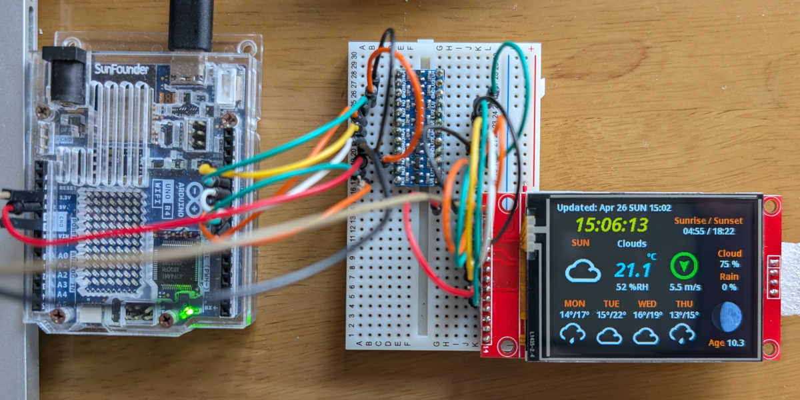

# ArduinoOpenWeather

## What is this?



This is yet another OpenWeather App for UNO R4 WiFi and ESP32.

Inspired by the cool screen design of [OpenWeahter][1] by [Bodmer, the creator of TFT_eSPI][2], I migrated it for my UNO R4 WiFi.

## Software Requirements

### libraries
- [moononournation/Arduino_GFX][3] v1.6.5
- [ArduinoJson][4] 7.4.3

### UNO R4 WiFi

| Package                    | Version                                     |
| -------------------------- | ------------------------------------------- |
| Board Platform             | [Arduino UNO R4 Boards by Arduino][5] 1.5.3 |
| NTP Client                 | [NTPClient][6] 3.2.1                        |
| HTTP Client (experimental) | [ArduinoHttpClient][7] 0.6.1                |

### ESP32

| Package        | Version                               |
| -------------- | ------------------------------------- |
| Board Platform | [esp32 by Espressif Systems][8] 3.3.8 |

## Software Configuration

1. Open [`config.h`][9] and and configure the following:

    | Item                  | Configuration Parameters                                             |
    | --------------------- | -------------------------------------------------------------------- |
    | **OpenWeather API**   | `LANGUAGE`, `LATITUDE` and `LONGITUDE`                               |
    | **Timezone**          | `TIMEZONE_OFFSET` (for UNO R4 WiFi) or `TIMEZONE_STRING` (for ESP32) |
    | **Screen Rotation**   | `TFT_ROTATION` (0,2: portrait / 1,3: landscape)                      |
    | **SPI GPIO pins**     | `TFT_DC`, `TFT_MISO`, `TFT_MOSI`, ...                                |

2. Create your `secrets.h` for WiFi credential and OpenWeather API key:

    ```c++
    #define SECRET_SSID "***** Your SSID *****"
    #define SECRET_PASS "***** Your password *****"
    #define API_KEY     "***** your OpenWeather key *****"
    ```

3. Open [`gfx.cpp`][10] and modify the Arduino_GFX code to suit your LCD device:

    ```c++
    #if defined(ARDUINO_UNOR4_WIFI)
    Arduino_DataBus *bus = new Arduino_HWSPI(TFT_DC, TFT_CS);
    Arduino_GFX *tft = new Arduino_ILI9341(bus, TFT_RST);
    #else // ESP32
    Arduino_DataBus *bus = new Arduino_HWSPI(TFT_DC, TFT_CS, TFT_SCLK, TFT_MOSI, TFT_MISO);
    Arduino_GFX *tft = new Arduino_ILI9341(bus, TFT_RST);
    #endif

    #define SPI_FREQ    40000000  // or 80000000
    ```

4. Open [`rtcntp.cpp`][11] and configure nearby NTP servers:

    ```c++
    static const char *ntpServers[] = {
      "ntp.nict.jp",
      "ntp.jst.mfeed.ad.jp",
      "pool.ntp.org",
      "time.google.com",
      //"europe.pool.ntp.org",
      //"time.cloudflare.com",
      //"time.aws.com",
    };
    ```

5. Open [OpenWeather.cpp][12] and change the following symbols for experimental feature:

    | Symbol in              | Default           |
    | ---------------------- | ----------------- |
    | `USE_SECURE_CLIENT`    | `true`            |
    | `USE_HTTP_CLIENT`      | `false`           |
    | `DESERIALIZATION_TYPE` | `TYPE_RAW_STREAM` |

## ToDo List

- [x] Fix the day of the week from 21:00 through midnight.
- [ ] Display progress on the opening splash screen.
- [ ] Make weather icons multi-colorizing.
- [ ] Make lunar phase images reverse for the Northern and Southern Hemispheres.
- [ ] Verify Daylight Saving Time by `timezone` in JSON.
- [ ] Supress debug printing to the Serial Monitor.

## Acknowledgement

### Icon Fonts

I would like to express my gratitude to the creators of these cool icon fonts:

- [kickstandapps/WeatherIcons][13] licensed under the [SIL OPEN FONT LICENSE Version 1.1][15].
- [erikflowers/weather-icons][14] licensed under the [SIL OPEN FONT LICENSE Version 1.1][15].


[1]: https://github.com/Bodmer/OpenWeather "Bodmer/OpenWeather: Arduino library to fetch weather information from OpenWeather"

[2]: https://github.com/Bodmer/TFT_espi "Bodmer/TFT_eSPI: Arduino and PlatformIO IDE compatible TFT library optimised for the Raspberry Pi Pico (RP2040), STM32, ESP8266 and ESP32 that supports different driver chips"

[3]: https://github.com/moononournation/Arduino_GFX "moononournation/Arduino_GFX: Arduino GFX developing for various color displays and various data bus interfaces"

[4]: https://github.com/bblanchon/ArduinoJson "bblanchon/ArduinoJson: 📟 JSON library for Arduino and embedded C++. Simple and efficient."

[5]: https://github.com/arduino/ArduinoCore-renesas "arduino/ArduinoCore-renesas"

[6]: https://github.com/arduino-libraries/NTPClient "arduino-libraries/NTPClient: Connect to a NTP server"

[7]: https://github.com/arduino-libraries/ArduinoHttpClient "arduino-libraries/ArduinoHttpClient: Arduino HTTP Client library"

[8]: https://github.com/espressif/arduino-esp32 "espressif/arduino-esp32: Arduino core for the ESP32"

[9]: config.h
[10]: gfx.cpp#L15-L30
[11]: rtcntp.cpp#L13-L20
[12]: OpenWeather.cpp#L13-L22

[13]: https://github.com/kickstandapps/WeatherIcons "kickstandapps/WeatherIcons: Open-sourced weather icons and font for UI design."

[14]: https://github.com/erikflowers/weather-icons "erikflowers/weather-icons: 215 Weather Themed Icons and CSS"

[15]: https://openfontlicense.org/open-font-license-official-text/ "SIL Open Font License Official Text"