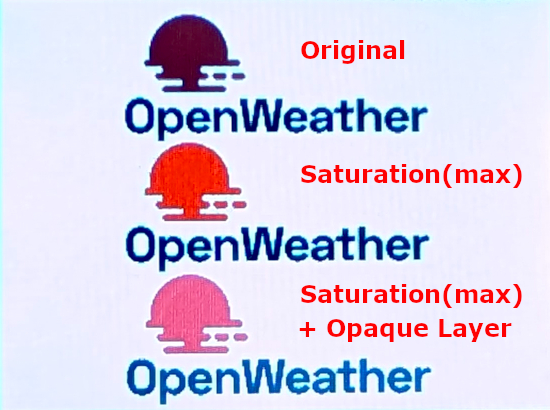

# How to create a header file for indexed color images

1. Open the target image in [GIMP][1].
2. Convert the image to [indexed mode][2] from the main menu through `Image` → `Mode` → `Indexed…`.
3. Export image as a [C source code header file][3] (extention: `.h`).
4. Execute `rgbconvert.py` as follows:
    ```bash
    % python rgbconvert.py input.h output.h
    ```
## Example

### input.h
```c++
/*  GIMP header image file format (INDEXED): /Users/name/Documents/Arduino/Arduino-UNO-R4/ILI9341/sample.h  */

static unsigned int width = 180;
static unsigned int height = 80;

/*  Call this macro repeatedly.  After each use, the pixel data can be extracted  */

#define HEADER_PIXEL(data,pixel) {\
pixel[0] = header_data_cmap[(unsigned char)data[0]][0]; \
pixel[1] = header_data_cmap[(unsigned char)data[0]][1]; \
pixel[2] = header_data_cmap[(unsigned char)data[0]][2]; \
data ++; }

static unsigned char header_data_cmap[256][3] = {
  { 58, 57, 60},
  ...
  {255,255,255}
  };
static unsigned char header_data[] = {
  254,254,254,254,254,254,254,254,254,254,254,254,254,254,254,254,
  ...
  254,254,254,254
  };
```

### output.h
```c++
#ifndef _OUTPUT_H_
#define _OUTPUT_H_

/*  GIMP header image file format (INDEXED): /Users/name/Documents/Arduino/Arduino-UNO-R4/ILI9341/sample.h  */

#define SAMPLE_WIDTH 180
#define SAMPLE_HEIGHT 80

/*  Call this macro repeatedly.  After each use, the pixel data can be extracted  */

#define HEADER_PIXEL(data,pixel) {\
pixel[0] = header_data_cmap[(unsigned char)data[0]][0]; \
pixel[1] = header_data_cmap[(unsigned char)data[0]][1]; \
pixel[2] = header_data_cmap[(unsigned char)data[0]][2]; \
data ++; }

static const unsigned short header_data_cmap[256] = {
  0x2966, 0x31A6, 0x39C7, 0x39C7, 0x39C7, 0x39E7, 0x39E7, 0x39E8,
  ...
  0xFFFF, 0xFFFF, 0xFFFF, 0xFFFF, 0xFFFF, 0xFFFF, 0xFFFF, 0xFFFF
};
static const unsigned char header_data[] = {
  0xFE, 0xFE, 0xFE, 0xFE, 0xFE, 0xFE, 0xFE, 0xFE, 0xFE, 0xFE, 0xFE, 0xFE, 0xFE, 0xFE, 0xFE, 0xFE,
  ...
  0xFE, 0xFE, 0xFE, 0xFE, 0xFE, 0xFE, 0xFE, 0xFE, 0xFE, 0xFE, 0xFE, 0xFE, 0xFE, 0xFE, 0xFE, 0xFE
};

#endif
```

# Saturation Enhancement for RGB565 Image

When converting an RGB888 image to RGB565, the colors displayed on the LCD may differ significantly.

In such cases, use GIMP to adjust settings like saturation and layer masks to bring the colors closer to the original.



[1]: https://www.gimp.org/ "GIMP - GNU Image Manipulation Program"
[2]: https://docs.gimp.org/3.2/en/gimp-image-convert-indexed.html "6.6. Indexed mode"
[3]: https://docs.gimp.org/3.2/en/file-header-export.html "5.24. Export Image as Header"